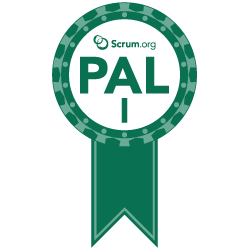

# Hey there!  :wave:

## About me

A Senior Product Manager building new decentralized products, ventures and markets.

## Experience

### Products

Using 15 years' structured trading and investment experience and >4 years' blockchain experience to develop new Decentralized Finance (DeFi) and Decentralized Exchange (DEx) products. This includes responsive web apps, decentralized apps (dApps) and analytics products.

### Agile

Worked in Agile teams for >4 years and hold Professional Agile Leadership and Professional Scrum Product Owner certifications from Scrum.org:

   

### Web Development

A [fellowship](https://www.mydigitalfuture.ch/) recipient learning web development at [EPFL Extension School](https://www.extensionschool.ch/). Experience with:

        

## Contact

You can find me here:

         

## Attribution

Please see the [image-icon-credits](/assets/image-icon-credits.md) file in this repo for licence and attribution of any icons and images used in this README.
